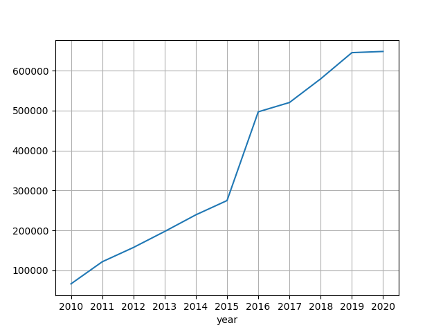

# About 🧑🏻‍⚖️

This repository aims to scrape Supreme Court of Indonesia's rulings website. It contains statistics and ruling details over several types, which are broken down into courts and time periods (year and month). Following are the ruling types:

|Type|Description|
|-|-|
|Perdata Agama||
|Pidana Umum||
|Perdata||
|Pidana Khusus||
|TUN||
|Perdata Khusus||
|Pidana Militer||
|Pajak||

# Permission

It looks like they don't limit whan information we can get from this website:

```
# https://mahkamahagung.go.id/robots.txt

User-agent: *
```

# Usage

Besides using the available datasets, you can also execute the code by yourself. You should have Python 3.6 or above installed. Here's the steps:

1. Clone the repository or download repository as ZIP

```bash
# clone repository through command line
# this includes .git directory
git clone https://github.com/ledwindra/mahkamah-agung.git
cd mahkamah-agung

# download repository through command line
# this doesn't include .git directory as opposed to cloning method
wget https://github.com/ledwindra/mahkamah-agung/archive/refs/heads/main.zip
unzip main.zip
cd mahkamah-agung-main
```

2. Use virtual environment and install requirements

```bash
python -m venv .venv
source .venv/bin/activate # macOS or Linux
pip install --upgrade pip
pip install -r requirements.txt
```

3. Go to Python REPL

```python
from rulings.scraper import Aggregate

aggregate = Aggregate()
aggregate.direktori()
2021-10-17 12:39:11 [GET 💾]: https://putusan3.mahkamahagung.go.id/direktori
2021-10-17 12:39:12 [SAVE ✅]: data/direktori.json
[{'direktori': 'PERDATA AGAMA', 'total': 4526802}, {'direktori': 'PIDANA UMUM', 'total': 661011}, {'direktori': 'PERDATA', 'total': 651167}, {'direktori': 'PIDANA KHUSUS', 'total': 412390}, {'direktori': 'TUN', 'total': 54580}, {'direktori': 'PERDATA KHUSUS', 'total': 33379}, {'direktori': 'PIDANA MILITER', 'total': 22219}, {'direktori': 'PAJAK', 'total': 8798}, {'direktori': 'SENGKETA KEWENANGAN MENGADILI', 'total': 6}]

aggregate.peradilan()
2021-10-17 12:40:34 [GET 💾]: https://putusan3.mahkamahagung.go.id/direktori
2021-10-17 12:40:34 [SAVE ✅]: data/peradilan.json
[{'peradilan': 'PERADILAN UMUM', 'total': 1593918}, {'peradilan': 'PERADILAN AGAMA', 'total': 4591291}, {'peradilan': 'PERADILAN MILITER', 'total': 24657}, {'peradilan': 'PERADILAN TATA USAHA NEGARA', 'total': 29955}, {'peradilan': 'PENGADILAN PAJAK', 'total': 22669}]

# since there are hundreds of courts the printed output below is not exhaustive
aggregate.periode()
2021-10-17 12:40:54 [GET 💾]: https://putusan3.mahkamahagung.go.id/direktori/periode/tahunjenis/putus.html
2021-10-17 12:40:55 [GET 💾]: https://putusan3.mahkamahagung.go.id/direktori/periode/tahunjenis/putus.html
2021-10-17 12:41:00 [SAVE ✅]: data/periode.json
2021-10-17 12:41:00 [GET 💾]: https://putusan3.mahkamahagung.go.id/direktori/periode/tahunjenis/putus/pengadilan/pn-jakarta-barat.html
2021-10-17 12:41:06 [SAVE ✅]: data/periode.json
2021-10-17 12:41:06 [GET 💾]: https://putusan3.mahkamahagung.go.id/direktori/periode/tahunjenis/putus/pengadilan/pn-kudus.html
2021-10-17 12:41:12 [SAVE ✅]: data/periode.json
...

# since there are many classifications available, the printed output below is not exhaustive
aggregate.klasifikasi()
2021-10-17 12:42:39 [GET 💾]: https://putusan3.mahkamahagung.go.id/direktori
2021-10-17 12:42:40 [GET 💾]: https://putusan3.mahkamahagung.go.id/direktori/index/kategori/perdata-agama-1.html
2021-10-17 12:42:47 [SAVE ✅]: data/klasifikasi.json
2021-10-17 12:42:47 [SAVE ✅]: data/klasifikasi.json
2021-10-17 12:42:47 [SAVE ✅]: data/klasifikasi.json
2021-10-17 12:42:47 [SAVE ✅]: data/klasifikasi.json
2021-10-17 12:42:47 [SAVE ✅]: data/klasifikasi.json
2021-10-17 12:42:47 [SAVE ✅]: data/klasifikasi.json
2021-10-17 12:42:47 [SAVE ✅]: data/klasifikasi.json
2021-10-17 12:42:47 [SAVE ✅]: data/klasifikasi.json
2021-10-17 12:42:47 [SAVE ✅]: data/klasifikasi.json
2021-10-17 12:42:47 [SAVE ✅]: data/klasifikasi.json
2021-10-17 12:42:47 [SAVE ✅]: data/klasifikasi.json
2021-10-17 12:42:47 [SAVE ✅]: data/klasifikasi.json
2021-10-17 12:42:47 [SAVE ✅]: data/klasifikasi.json
2021-10-17 12:42:47 [SAVE ✅]: data/klasifikasi.json
2021-10-17 12:42:47 [SAVE ✅]: data/klasifikasi.json
2021-10-17 12:42:47 [GET 💾]: https://putusan3.mahkamahagung.go.id/direktori/index/kategori/pidana-umum-1.html
...
[{'direktori': 'perdata-agama-1', 'klasifikasi': 'Perdata Agama', 'total': '4526805'}, {'direktori': 'perceraian', 'klasifikasi': 'Perceraian', 'total': '3577667'}, {'direktori': 'pengesahan-nikah-1', 'klasifikasi': 'Pengesahan Nikah', 'total': '49677'}, {'direktori': 'waris-islam-1', 'klasifikasi': 'Waris Islam', 'total': '28024'}, {'direktori': 'sengketa-perkawinan-lainnya-1', 'klasifikasi': 'Sengketa Perkawinan Lainnya', 'total': '17939'}, {'direktori': 'harta-bersama-1', 'klasifikasi': 'Harta Bersama', 'total': '16462'}, {'direktori': 'perwalian-1', 'klasifikasi': 'Perwalian', 'total': '11626'}, {'direktori': 'dispensasi-nikah-1', 'klasifikasi': 'Dispensasi Nikah', 'total': '8319'}, {'direktori': 'izin-poligami-1', 'klasifikasi': 'Izin Poligami', 'total': '5841'}, {'direktori': 'ekonomi-syari-ah-1', 'klasifikasi': 'Ekonomi Syariah', 'total': '2092'}, {'direktori': 'pembatalan-nikah-1', 'klasifikasi': 'Pembatalan Nikah', 'total': '1471'}, {'direktori': 'hibah-1', 'klasifikasi': 'Hibah', 'total': '1023'}, {'direktori': 'wasiat-1', 'klasifikasi': 'Wasiat', 'total': '720'}, {'direktori': 'wakaf-1', 'klasifikasi': 'Wakaf', 'total': '352'}, {'direktori': 'permohonan-hibah', 'klasifikasi': 'Permohonan Hibah', 'total': '20'}, {'direktori': 'pidana-umum-1', 'klasifikasi': 'Pidana Umum', 'total': '661032'}, {'direktori': 'pencurian-1', 'klasifikasi': 'Pencurian', 'total': '163252'}, {'direktori': 'kejahatan-terhadap-keamanan-negara', 'klasifikasi': 'Kejahatan terhadap keamanan negara', 'total': '69070'}, {'direktori': 'penghinaan-1', 'klasifikasi': 'Penghinaan', 'total': '50191'}, {'direktori': 'perjudian-1', 'klasifikasi': 'Perjudian', 'total': '49937'}, {'direktori': 'penganiayaan-1', 'klasifikasi': 'Penganiayaan', 'total': '48244'}, {'direktori': 'penggelapan-1', 'klasifikasi': 'Penggelapan', 'total': '33766'}, {'direktori': 'penipuan-1', 'klasifikasi': 'Penipuan', 'total': '24729'}, {'direktori': 'penadahan-1', 'klasifikasi': 'Penadahan', 'total': '18878'}, {'direktori': 'pembunuhan-1', 'klasifikasi': 'Pembunuhan', 'total': '7348'}, {'direktori': 'pemalsuan-1', 'klasifikasi': 'Pemalsuan', 'total': '6124'}, {'direktori': 'kejahatan-terhadap-kesusilaan-1', 'klasifikasi': 'Kejahatan terhadap Kesusilaan', 'total': '5260'}, {'direktori': 'kealfaan-mengakibatkan-kematian-luka-1', 'klasifikasi': 'Kealfaan mengakibatkan kematianluka', 'total': '5087'}, {'direktori': 'perusakan-1', 'klasifikasi': 'Perusakan', 'total': '4096'}, {'direktori': 'pemerasan-dan-pengancaman-1', 'klasifikasi': 'Pemerasan dan Pengancaman', 'total': '3726'}, {'direktori': 'kejahatan-terhadap-keteriban-umum-1', 'klasifikasi': 'Kejahatan terhadap Keteriban Umum', 'total': '3491'}, {'direktori': 'lalu-lintas-1', 'klasifikasi': 'Lalu Lintas', 'total': '2452'}, {'direktori': 'jinayat-1', 'klasifikasi': 'Jinayat', 'total': '1799'}, {'direktori': 'kejahatan-terhadap-kemerdekaan-orang-lain-1', 'klasifikasi': 'Kejahatan terhadap kemerdekaan orang lain', 'total': '1059'}, {'direktori': 'kejahatan-terhadap-asal-usul-perkawinan-1', 'klasifikasi': 'Kejahatan terhadap asal usul perkawinan', 'total': '957'}, {'direktori': 'pra-peradilan-1', 'klasifikasi': 'Pra Peradilan', 'total': '492'}, {'direktori': 'pemerasaan-dan-pengancaman-1', 'klasifikasi': 'Pemerasaan dan Pengancaman', 'total': '480'}, {'direktori': 'kehutanan-1', 'klasifikasi': 'Kehutanan', 'total': '325'}, {'direktori': 'sumpah-palsu-dan-keterangan-palsu-1', 'klasifikasi': 'Sumpah Palsu dan Keterangan Palsu', 'total': '300'}, {'direktori': 'pemalsuan-uang', 'klasifikasi': 'Pemalsuan Uang', 'total': '266'}, {'direktori': 'perdata-1', 'klasifikasi': 'Perdata', 'total': '651173'}, {'direktori': 'perceraian-2', 'klasifikasi': 'Perceraian', 'total': '85730'}, {'direktori': 'perbuatan-melawan-hukum-1', 'klasifikasi': 'Perbuatan Melawan Hukum', 'total': '82730'}, {'direktori': 'tanah-1', 'klasifikasi': 'Tanah', 'total': '36172'}, {'direktori': 'permohonan-1', 'klasifikasi': 'Permohonan', 'total': '17669'}, {'direktori': 'wanprestasi-1', 'klasifikasi': 'Wanprestasi', 'total': '14940'}, {'direktori': 'waris-1', 'klasifikasi': 'Waris', 'total': '5442'}, {'direktori': 'perjanjian-1', 'klasifikasi': 'Perjanjian', 'total': '3714'}, {'direktori': 'pembagian-harta-1', 'klasifikasi': 'Pembagian Harta', 'total': '1331'}, {'direktori': 'pidana-khusus-1', 'klasifikasi': 'Pidana Khusus', 'total': '412413'}, {'direktori': 'narkotika-dan-psikotropika-1', 'klasifikasi': 'Narkotika dan Psikotropika', 'total': '257165'}, {'direktori': 'korupsi-1', 'klasifikasi': 'Korupsi', 'total': '25028'}, {'direktori': 'peradilan-anak-abh-1', 'klasifikasi': 'Peradilan Anak ABH', 'total': '19586'}, {'direktori': 'anak-1', 'klasifikasi': 'Anak', 'total': '16028'}, {'direktori': 'senjata-api-2', 'klasifikasi': 'Senjata Api', 'total': '11918'}, {'direktori': 'lain-lain-1', 'klasifikasi': 'Lain-lain', 'total': '9869'}, {'direktori': 'lingkungan-hidup-2', 'klasifikasi': 'Lingkungan Hidup', 'total': '9038'}, {'direktori': 'kdrt-1', 'klasifikasi': 'KDRT', 'total': '6507'}, {'direktori': 'ite-1', 'klasifikasi': 'ITE', 'total': '3058'}, {'direktori': 'farmasi-1', 'klasifikasi': 'Farmasi', 'total': '2615'}, {'direktori': 'perikanan-1', 'klasifikasi': 'Perikanan', 'total': '2260'}, {'direktori': 'pertambangan-1', 'klasifikasi': 'Pertambangan', 'total': '1891'}, {'direktori': 'perdagangan-orang-1', 'klasifikasi': 'Perdagangan Orang', 'total': '956'}, {'direktori': 'pemilu-1', 'klasifikasi': 'Pemilu', 'total': '577'}, {'direktori': 'mata-uang-1', 'klasifikasi': 'Mata Uang', 'total': '502'}, {'direktori': 'kepabeanan-1', 'klasifikasi': 'Kepabeanan', 'total': '483'}, {'direktori': 'pornografi-1', 'klasifikasi': 'Pornografi', 'total': '460'}, {'direktori': 'migas-1', 'klasifikasi': 'Migas', 'total': '456'}, {'direktori': 'pelayaran-1', 'klasifikasi': 'Pelayaran', 'total': '405'}, {'direktori': 'perpajakan-1', 'klasifikasi': 'Perpajakan', 'total': '394'}, {'direktori': 'uang-palsu-1', 'klasifikasi': 'Uang Palsu', 'total': '387'}, {'direktori': 'pidsus-perkebunan-1', 'klasifikasi': 'Pidsus Perkebunan', 'total': '375'}, {'direktori': 'pidsus-kehutanan-1', 'klasifikasi': 'Pidsus Kehutanan', 'total': '373'}, {'direktori': 'illegal-logging-1', 'klasifikasi': 'Illegal Logging', 'total': '335'}, {'direktori': 'pencucian-uang-1', 'klasifikasi': 'Pencucian Uang', 'total': '292'}, {'direktori': 'keimigrasian-1', 'klasifikasi': 'Keimigrasian', 'total': '286'}, {'direktori': 'pidana-perlindungan-konsumen-1', 'klasifikasi': 'Pidana Perlindungan Konsumen', 'total': '267'}, {'direktori': 'pidsus-terorisme-2', 'klasifikasi': 'Pidsus Terorisme', 'total': '255'}, {'direktori': 'perbankan-1', 'klasifikasi': 'Perbankan', 'total': '246'}, {'direktori': 'ham-1', 'klasifikasi': 'HAM', 'total': '165'}, {'direktori': 'pangan-1', 'klasifikasi': 'Pangan', 'total': '154'}, {'direktori': 'fidusia-1', 'klasifikasi': 'Fidusia', 'total': '148'}, {'direktori': 'pidsus-cukai-1', 'klasifikasi': 'Pidsus Cukai', 'total': '137'}, {'direktori': 'konservasi-sda-1', 'klasifikasi': 'Konservasi SDA', 'total': '79'}, {'direktori': 'kejahatan-merek-1', 'klasifikasi': 'Kejahatan Merek', 'total': '41'}, {'direktori': 'kejahatan-hak-cipta-1', 'klasifikasi': 'Kejahatan Hak Cipta', 'total': '34'}, {'direktori': 'pidsus-pra-peradilan-1', 'klasifikasi': 'Pidsus Pra Peradilan', 'total': '34'}, {'direktori': 'penempatan-dan-perlindungan-tki-1', 'klasifikasi': 'Penempatan dan Perlindungan TKI', 'total': '32'}, {'direktori': 'penyiaran-1', 'klasifikasi': 'Penyiaran', 'total': '31'}, {'direktori': 'tindak-pidana-ekonomi-1', 'klasifikasi': 'Tindak Pidana Ekonomi', 'total': '30'}, {'direktori': 'pengelolaan-wilayah-pesisir-1', 'klasifikasi': 'Pengelolaan Wilayah Pesisir', 'total': '30'}, {'direktori': 'penistaan-1', 'klasifikasi': 'Penistaan', 'total': '30'}, {'direktori': 'ketenagakerjaan-1', 'klasifikasi': 'Ketenagakerjaan', 'total': '28'}, {'direktori': 'pemerintah-daerah-1', 'klasifikasi': 'Pemerintah Daerah', 'total': '19'}, {'direktori': 'rahasia-dagang-1', 'klasifikasi': 'Rahasia Dagang', 'total': '15'}, {'direktori': 'ketenagalistrikan-1', 'klasifikasi': 'Ketenagalistrikan', 'total': '14'}, {'direktori': 'perumahan-dan-pemukiman-1', 'klasifikasi': 'Perumahan dan Pemukiman', 'total': '11'}, {'direktori': 'pidsus-industri-1', 'klasifikasi': 'Pidsus Industri', 'total': '8'}, {'direktori': 'pidsus-pendidikan-1', 'klasifikasi': 'Pidsus Pendidikan', 'total': '8'}, {'direktori': 'praperadilan-jinayat-1', 'klasifikasi': 'Praperadilan Jinayat', 'total': '4'}, {'direktori': 'tun-1', 'klasifikasi': 'TUN', 'total': '54580'}, {'direktori': 'pajak', 'klasifikasi': 'Pajak', 'total': '20541'}, {'direktori': 'pertanahan-1', 'klasifikasi': 'Pertanahan', 'total': '12260'}, {'direktori': 'kepegawaian-1', 'klasifikasi': 'Kepegawaian', 'total': '6032'}, {'direktori': 'lain-lain-termasuk-piutang-1', 'klasifikasi': 'Lain lain termasuk Piutang', 'total': '4341'}, {'direktori': 'perijinan-1', 'klasifikasi': 'Perijinan', 'total': '2308'}, {'direktori': 'hak-uji-materiil-1', 'klasifikasi': 'Hak Uji Materiil', 'total': '811'}, {'direktori': 'pilkada-1', 'klasifikasi': 'Pilkada', 'total': '763'}, {'direktori': 'lelang-1', 'klasifikasi': 'Lelang', 'total': '516'}, {'direktori': 'tender-1', 'klasifikasi': 'Tender', 'total': '323'}, {'direktori': 'kip-2', 'klasifikasi': 'KIP', 'total': '317'}, {'direktori': 'badan-hukum-1', 'klasifikasi': 'Badan Hukum', 'total': '286'}, {'direktori': 'partai-politik-1', 'klasifikasi': 'Partai Politik', 'total': '169'}, {'direktori': 'perumahan-1', 'klasifikasi': 'Perumahan', 'total': '103'}, {'direktori': 'pendidikan-1', 'klasifikasi': 'Pendidikan', 'total': '92'}, {'direktori': 'kependudukan-kewarganegaraan-1', 'klasifikasi': 'Kependudukan Kewarganegaraan', 'total': '44'}, {'direktori': 'pelanggaran-administrasi-pemilihan-1', 'klasifikasi': 'Pelanggaran Administrasi Pemilihan', 'total': '12'}, {'direktori': 'asuransi-1', 'klasifikasi': 'Asuransi', 'total': '7'}, {'direktori': 'perdata-khusus', 'klasifikasi': 'Perdata Khusus', 'total': '33380'}, {'direktori': 'phi', 'klasifikasi': 'PHI', 'total': '17350'}, {'direktori': 'kepailitan', 'klasifikasi': 'Kepailitan', 'total': '2280'}, {'direktori': 'perlindungan-konsumen-1', 'klasifikasi': 'Perlindungan Konsumen', 'total': '1395'}, {'direktori': 'merek', 'klasifikasi': 'Merek', 'total': '867'}, {'direktori': 'parpol-1', 'klasifikasi': 'Parpol', 'total': '445'}, {'direktori': 'arbitrase', 'klasifikasi': 'Arbitrase', 'total': '391'}, {'direktori': 'persaingan-usaha', 'klasifikasi': 'Persaingan Usaha', 'total': '232'}, {'direktori': 'hak-cipta', 'klasifikasi': 'Hak Cipta', 'total': '199'}, {'direktori': 'desain-industri', 'klasifikasi': 'Desain Industri', 'total': '121'}, {'direktori': 'paten', 'klasifikasi': 'Paten', 'total': '88'}, {'direktori': 'pidana-militer-1', 'klasifikasi': 'Pidana Militer', 'total': '22219'}, {'direktori': 'disersi-1', 'klasifikasi': 'Disersi', 'total': '3676'}, {'direktori': 'kesusilaan-1', 'klasifikasi': 'Kesusilaan', 'total': '1335'}, {'direktori': 'subordinasi-1', 'klasifikasi': 'Subordinasi', 'total': '59'}, {'direktori': 'pajak-2', 'klasifikasi': 'Pajak', 'total': '8798'}, {'direktori': 'pajak-pertambahan-nilai-ppn-1', 'klasifikasi': 'Pajak Pertambahan NilaiPPN', 'total': '3844'}, {'direktori': 'bea-masuk-1', 'klasifikasi': 'Bea Masuk', 'total': '2060'}, {'direktori': 'gugatan-atas-keputusan-1', 'klasifikasi': 'Gugatan Atas Keputusan', 'total': '706'}, {'direktori': 'pajak-penghasilan-badan-pphbd-1', 'klasifikasi': 'Pajak Penghasilan BadanPPhBd', 'total': '672'}, {'direktori': 'pajak-penghasilan-pasal-26-pph26-1', 'klasifikasi': 'Pajak Penghasilan Pasal 26PPh26', 'total': '292'}, {'direktori': 'pajak-penghasilan-pasal-23-pph-24', 'klasifikasi': 'Pajak Penghasilan Pasal 23PPh23', 'total': '288'}, {'direktori': 'cukai-1', 'klasifikasi': 'Cukai', 'total': '280'}, {'direktori': 'pajak-kendaraan-bermotor-pkb-1', 'klasifikasi': 'Pajak Kendaraan BermotorPKB', 'total': '137'}, {'direktori': 'pajak-penghasilan-pasal-4-ayat-2-final-1', 'klasifikasi': 'Pajak Penghasilan Pasal 4 ayat 2 Final', 'total': '103'}, {'direktori': 'pajak-penghasilan-pasal-21-pph21-1', 'klasifikasi': 'Pajak Penghasilan Pasal 21PPh21', 'total': '94'}, {'direktori': 'pajak-bumi-dan-bangunan-pbb-1', 'klasifikasi': 'Pajak Bumi dan BangunanPBB', 'total': '53'}, {'direktori': 'pajak-penjualan-barang-mewah-ppnbm-1', 'klasifikasi': 'Pajak Penjualan Barang MewahPPnBM', 'total': '44'}, {'direktori': 'pajak-penghasilan-pasal-15-final-1', 'klasifikasi': 'Pajak Penghasilan Pasal 15 Final', 'total': '34'}, {'direktori': 'stp-bunga-penagihan-1', 'klasifikasi': 'STP Bunga Penagihan', 'total': '27'}, {'direktori': 'pajak-pemanfaatan-air-bawah-tanah-air-permukaan-1', 'klasifikasi': 'Pajak Pemanfaatan Air Bawah Tanah Air Permukaan', 'total': '26'}, {'direktori': 'lain-lain-tidak-ada-dalam-tabel-1', 'klasifikasi': 'Lain-lainTidak ada dalam tabel', 'total': '24'}, {'direktori': 'pajak-penghasilan-orang-pribadi-pph-pers-1', 'klasifikasi': 'Pajak Penghasilan Orang PribadiPPhPers', 'total': '22'}, {'direktori': 'pajak-penghasilan-pasal-22-pph22-1', 'klasifikasi': 'Pajak Penghasilan Pasal 22PPh22', 'total': '21'}, {'direktori': 'pajak-penghasilan-pasal-22-final-1', 'klasifikasi': 'Pajak Penghasilan Pasal 22 Final', 'total': '21'}, {'direktori': 'bea-balik-nama-kendaraan-bermotor-1', 'klasifikasi': 'Bea Balik Nama Kendaraan Bermotor', 'total': '17'}, {'direktori': 'pajak-penghasilan-pasal-21-final-1', 'klasifikasi': 'Pajak Penghasilan Pasal 21 Final', 'total': '13'}, {'direktori': 'pajak-penghasilan-pasal-25-final-1', 'klasifikasi': 'Pajak Penghasilan Pasal 25 Final', 'total': '7'}, {'direktori': 'bea-perolehan-hak-atas-tanah-dan-atau-bangunan-1', 'klasifikasi': 'Bea Perolehan Hak Atas Tanah dan atau Bangunan', 'total': '6'}, {'direktori': 'pajak-hiburan-phi-1', 'klasifikasi': 'Pajak HiburanPHi', 'total': '5'}, {'direktori': 'pajak-pembangunan-i-ppb-i-1', 'klasifikasi': 'Pajak Pembangunan IPPbI', 'total': '2'}, {'direktori': 'pajak-penerangan-jalan-ppj-1', 'klasifikasi': 'Pajak Penerangan JalanPPJ', 'total': '1'}, {'direktori': 'sengketa-kewenangan-mengadili-1', 'klasifikasi': 'Sengketa Kewenangan Mengadili', 'total': '6'}]

# the printed output will be too many to be put inside here
aggregate.periode_klasifikasi()
...
```

4. [Optional] For analytics purpose, you can create dataframes and visualizations from the datasets
```python
>>> import pandas as pd
>>> import matplotlib.pyplot as plt
>>> from src.scraper import Aggregate
>>> aggregate = Aggregate()
>>> df = pd.DataFrame(aggregate.by_year("perdata-agama-1", "putus"))
2021-08-18 07:55:22 [GET 💾]: https://putusan3.mahkamahagung.go.id/direktori/periode/tahunjenis/putus/kategori/perdata-agama-1.html
>>> df = df[df.year.between(2010, 2020)]
>>> df
    year   total
17  2020  647949
18  2019  644994
19  2018  579438
20  2017  520160
21  2016  496834
22  2015  274743
23  2014  238951
24  2013  197292
25  2012  157248
26  2011  121437
27  2010   66195
>>> df.plot(x="year", y="total", grid=True, legend=False, xticks=range(2010, 2021))
<AxesSubplot:xlabel='year'>
>>> plt.savefig("img/perdata-agama-putus.png")
```

## Line graph example

<p align="left"></p>

# Miscellaneous
- Submit issues [here](https://github.com/ledwindra/mahkamah-agung/issues) if you have any questions of find any bug.
- This repository is mostly developed using [GitHub Codespaces](https://github.com/features/codespaces) which is 🌟 insanely 🌟 awesome 🌟.
